# BRANT · Bacu Creative — Referencia de código

Código real y completo del portafolio, para pegar en Stitch junto con
`design.md` (que explica el sistema visual en prosa). Este archivo es el
código en sí: pégalo cuando quieras que Stitch genere o modifique algo que
tenga que **encajar de verdad** con lo que ya existe (mismas clases,
mismas variables CSS, misma estructura).

No están los 7 archivos HTML completos (la mayoría comparten exactamente
el mismo `<head>`, preloader, nav y footer — solo cambia el `<main>`) sino
3 representativos: `home.html` (el hero/collage, lo más complejo),
`fotografia.html` (grids de fotos + tarjetas de sesión + lightbox) y
`sesion.html` (la plantilla reusable de una sesión). El resto
(`sobre-mi.html`, `proyectos.html`, `contacto.html`, `index.html`) siguen
el mismo esqueleto, solo con otro contenido en `<main>`.

---

## css/style.css

Un solo archivo, sin preprocesador. Variables en `:root`, luego utilidades
(`.container`, `.kicker`, `.h-serif`, `.on-dark`...), luego un bloque por
componente en orden de aparición en el sitio.

```css
:root{
  --cream:        #f8f8f6;
  --cream-2:      #f1f0ec;
  --ink:          #1c1a17;
  --ink-2:        #221d1e;
  --green:        #2c6754;
  --green-light:  #4d7f6e;
  --laser:        #6bf0b0;
  --line:         #d2d9d2;
  --line-dark:    #333a36;
  --muted:        #726e67;
  --muted-dark:   #9b9892;

  --f-display: 'Anton', sans-serif;
  --f-serif:   'Playfair Display', serif;
  --f-sans:    'Inter', sans-serif;

  --container: 1180px;
  --pad: clamp(24px, 5vw, 96px);
}

*, *::before, *::after{ box-sizing: border-box; }
html{ scroll-behavior: smooth; }
body{
  margin: 0;
  background: var(--cream);
  color: var(--ink);
  font-family: var(--f-sans);
  font-size: 16px;
  line-height: 1.6;
  -webkit-font-smoothing: antialiased;
}
img{ max-width: 100%; display: block; }
a{ color: inherit; text-decoration: none; }
h1,h2,h3,h4,p,figure{ margin: 0; }
ul{ margin: 0; padding: 0; list-style: none; }
section{ position: relative; }

.container{
  max-width: var(--container);
  margin: 0 auto;
  padding-left: var(--pad);
  padding-right: var(--pad);
}

/* ---------- Kicker / labels ---------- */
.kicker{
  font-family: var(--f-sans);
  font-size: 12px;
  letter-spacing: 0.22em;
  text-transform: uppercase;
  color: var(--green);
  font-weight: 600;
}
.on-dark .kicker{ color: var(--green-light); }

/* ---------- Headings ---------- */
.h-serif{
  font-family: var(--f-serif);
  font-weight: 500;
  line-height: 1.08;
  letter-spacing: -0.01em;
}
.h-display{
  font-family: var(--f-display);
  font-weight: 400;
  text-transform: uppercase;
  letter-spacing: 0.01em;
  line-height: 0.95;
}
.section-title{
  font-size: clamp(2.2rem, 4.5vw, 3.4rem);
  margin-top: 10px;
}

/* ---------- Sections (color blocks) ---------- */
.on-dark{ background: var(--ink-2); color: var(--cream); }
.on-green{ background: var(--green); color: var(--cream); }
.on-cream{ background: var(--cream); color: var(--ink); }
.on-cream-2{ background: var(--cream-2); color: var(--ink); }

section.pad{ padding: clamp(64px, 10vw, 140px) 0; }

.divider{
  height: 1px;
  background: var(--line);
  border: none;
  margin: 0;
}
.on-dark .divider{ background: var(--line-dark); }

/* ---------- Nav ---------- */
.site-header{
  position: sticky;
  top: 0;
  z-index: 100;
  background: var(--cream);
  border-bottom: 1px solid var(--line);
}
.nav{
  display: flex;
  align-items: center;
  justify-content: space-between;
  padding: 18px var(--pad);
}
.brand-mark{
  display: flex;
  align-items: center;
  gap: 10px;
}
.brand-mark svg{ width: 26px; height: 26px; }
.brand-icon{
  width: 30px;
  height: auto;
  transform-origin: center;
  animation: logoBlink 5s ease-in-out infinite;
}
@keyframes logoBlink{
  0%, 92%, 100%{ transform: scaleY(1); }
  95%{ transform: scaleY(0.1); }
}
.brand-text{
  display: flex;
  flex-direction: column;
  line-height: 1;
}
.brand-name{
  font-family: var(--f-display);
  font-size: 1.3rem;
  letter-spacing: 0.03em;
}
.brand-tag{
  font-family: var(--f-sans);
  font-size: 11px;
  font-weight: 800;
  font-style: italic;
  letter-spacing: 0.005em;
  text-transform: uppercase;
  color: var(--green);
  margin-top: 2px;
}
.nav-links{
  display: flex;
  gap: 36px;
  font-size: 13px;
  letter-spacing: 0.08em;
  text-transform: uppercase;
  font-weight: 600;
}
.nav-links a{
  position: relative;
  padding-bottom: 4px;
  color: var(--ink);
  opacity: 0.75;
  transition: opacity .2s;
}
.nav-links a:hover, .nav-links a.active{ opacity: 1; }
.nav-links a.active::after{
  content:"";
  position:absolute; left:0; right:0; bottom:-2px;
  height:2px; background: var(--green);
}
.nav-toggle{
  display: none;
  background: none;
  border: none;
  cursor: pointer;
  padding: 4px;
}
.nav-toggle span{
  display: block;
  width: 24px;
  height: 2px;
  background: var(--ink);
  margin: 5px 0;
  transition: transform .2s, opacity .2s;
}

@media (max-width: 780px){
  .nav-links{
    position: fixed;
    inset: 64px 0 0 0;
    background: var(--cream);
    flex-direction: column;
    gap: 0;
    padding: 12px var(--pad) 40px;
    transform: translateY(-8px);
    opacity: 0;
    pointer-events: none;
    transition: opacity .2s, transform .2s;
  }
  .nav-links.open{
    opacity: 1;
    transform: translateY(0);
    pointer-events: auto;
  }
  .nav-links a{
    display: block;
    padding: 16px 0;
    border-bottom: 1px solid var(--line);
    opacity: 1;
  }
  .nav-toggle{ display: block; }
}

/* ---------- Buttons ---------- */
.btn{
  display: inline-flex;
  align-items: center;
  gap: 10px;
  padding: 14px 28px;
  font-size: 13px;
  font-weight: 600;
  letter-spacing: 0.08em;
  text-transform: uppercase;
  border: 1px solid currentColor;
  border-radius: 2px;
  transition: background .25s ease, color .25s ease, transform .25s ease, box-shadow .25s ease;
}
.btn:hover{ transform: translateY(-2px); }
.btn:active{ transform: translateY(0); }
.btn-solid{
  background: var(--ink);
  color: var(--cream);
  border-color: var(--ink);
}
.btn-solid:hover{ background: var(--green); border-color: var(--green); box-shadow: 0 10px 24px -12px rgba(44,103,84,0.5); }
.btn-outline:hover{ background: var(--ink); color: var(--cream); }
.on-dark .btn-outline{ color: var(--cream); }
.on-dark .btn-outline:hover{ background: var(--cream); color: var(--ink); }

.nav-links a::before{
  content: "";
  position: absolute; left: 0; right: 100%; bottom: -2px;
  height: 2px; background: var(--green-light);
  transition: right .25s ease;
}
.nav-links a:hover::before{ right: 0; }

/* ---------- Hero (Inicio) ---------- */
.hero{
  background: var(--ink-2);
  color: var(--cream);
  position: relative;
  overflow: hidden;
  padding-top: clamp(48px, 8vw, 90px);
}
.hero-top{
  display: flex;
  justify-content: space-between;
  align-items: flex-start;
  gap: 12px;
  padding: 0 var(--pad);
  font-size: 12px;
  letter-spacing: 0.22em;
  text-transform: uppercase;
  color: var(--muted-dark);
}
.hero-top span:first-child{ flex: 1; }
.hero-top span:last-child{ white-space: nowrap; }
@media (max-width: 560px){
  .hero-top{ flex-direction: column; gap: 6px; }
}
.hero-top .accent{ color: var(--green-light); }
.hero-name{
  font-family: var(--f-display);
  font-size: clamp(5rem, 18vw, 12rem);
  text-align: center;
  margin: 18px 0 6px;
  letter-spacing: 0.01em;
}
.hero-handle{
  text-align: center;
  font-family: var(--f-display);
  text-transform: uppercase;
  letter-spacing: 0.06em;
  font-size: clamp(1rem, 2.6vw, 1.5rem);
  color: var(--muted-dark);
  margin-bottom: 20px;
}
/* ---------- Collage (torn-paper cover) ---------- */
.collage{
  position: relative;
  margin-top: clamp(28px, 5vw, 56px);
  padding: 9% var(--pad) 6%;
  min-height: clamp(480px, 78vw, 820px);
  background: var(--cream);
  clip-path: polygon(
    0% 4%, 4% 1%, 8% 5%, 13% 0%, 18% 4%, 23% 1%, 28% 5%, 33% 2%,
    38% 6%, 43% 1%, 48% 4%, 53% 0%, 58% 5%, 63% 2%, 68% 6%, 73% 1%,
    78% 4%, 83% 0%, 88% 5%, 93% 2%, 100% 4%,
    100% 100%, 0% 100%
  );
  overflow: hidden;
}
.collage::before{
  content: "";
  position: absolute;
  inset: 0;
  z-index: 0;
  background:
    url('../assets/img/torn-paper-frame.png') center/100% 100% no-repeat,
    linear-gradient(rgba(248,247,243,0.75), rgba(248,247,243,0.75)),
    url('../assets/img/newspaper-texture.jpg') center/420px repeat;
}
.collage-inner{
  position: relative;
  z-index: 2;
  max-width: 1000px;
  margin: 0 auto;
  text-align: center;
}
.title-orbit{ position: relative; transform: translateY(clamp(115px, 13vw, 165px)); }
.collage-title{
  position: relative;
  z-index: 2;
  font-family: var(--f-display);
  color: #17140f;
  font-size: clamp(4rem, 19vw, 11rem);
  line-height: 0.86;
  letter-spacing: 0.005em;
  animation: titleLevitate 4s ease-in-out infinite;
}
.collage-title .line{
  position: relative;
  display: block;
}
.collage-title .line::before{
  content: "";
  position: absolute;
  inset: -35% -8%;
  z-index: -1;
  background-position: center;
  background-repeat: no-repeat;
  background-size: 100% 100%;
}
.collage-title .line-portafolio::before{ background-image: url('../assets/img/glow-portafolio.png'); }
.collage-title .line-creativo::before{ background-image: url('../assets/img/glow-creativo.png'); }

/* ---------- Eye orbit: 9 eyes levitating the title with laser beams ---------- */
.eye-orbit{
  position: absolute;
  inset: -24% -6% -10%;
  z-index: 0;
  overflow: visible;
  pointer-events: none;
}
.eye-orbit .laser{
  stroke: var(--laser);
  stroke-width: 6;
  stroke-linecap: round;
  opacity: 0.85;
  filter: drop-shadow(0 0 5px rgba(107,240,176,0.9));
  animation: laserPulse 2.2s ease-in-out infinite;
}
.eye-orbit .orbit-eye-img{
  transform-box: fill-box;
  filter: drop-shadow(0 0 9px rgba(107,240,176,0.9));
  animation: eyeTugA 2.4s ease-in-out infinite;
}
.eye-orbit .orbit-eye-img.n2{ animation-name: eyeTugB; animation-duration: 2.1s; animation-delay: .15s; }
.eye-orbit .orbit-eye-img.n3{ animation-name: eyeTugC; animation-duration: 2.6s; animation-delay: .5s; }
.eye-orbit .orbit-eye-img.n4{ animation-name: eyeTugA; animation-duration: 2.0s; animation-delay: .3s; }
.eye-orbit .orbit-eye-img.n5{ animation-name: eyeTugB; animation-duration: 2.5s; animation-delay: .65s; }
.eye-orbit .orbit-eye-img.n6{ animation-name: eyeTugC; animation-duration: 2.2s; animation-delay: .1s; }
.eye-orbit .orbit-eye-img.n7{ animation-name: eyeTugA; animation-duration: 2.7s; animation-delay: .45s; }
.eye-orbit .orbit-eye-img.n8{ animation-name: eyeTugB; animation-duration: 1.9s; animation-delay: .35s; }
.eye-orbit .orbit-eye-img.n9{ animation-name: eyeTugC; animation-duration: 2.3s; animation-delay: .55s; }
.eye-orbit .laser.n2{ animation-delay: .2s; animation-duration: 2.0s; }
.eye-orbit .laser.n3{ animation-delay: .4s; animation-duration: 2.5s; }
.eye-orbit .laser.n4{ animation-delay: .6s; animation-duration: 1.9s; }
.eye-orbit .laser.n5{ animation-delay: .8s; animation-duration: 2.3s; }
.eye-orbit .laser.n6{ animation-delay: 1s; animation-duration: 2.1s; }
.eye-orbit .laser.n7{ animation-delay: 1.2s; animation-duration: 2.6s; }
.eye-orbit .laser.n8{ animation-delay: 1.4s; animation-duration: 2.0s; }
.eye-orbit .laser.n9{ animation-delay: 1.6s; animation-duration: 2.4s; }
@keyframes titleLevitate{
  0%, 100%{ transform: translateY(0); }
  50%{ transform: translateY(-8px); }
}
@keyframes eyeTugA{
  0%, 100%{ transform: translate(0,0) rotate(0deg); }
  25%{ transform: translate(-7px,-10px) rotate(-9deg); }
  50%{ transform: translate(5px,-3px) rotate(6deg); }
  75%{ transform: translate(-4px,-12px) rotate(-5deg); }
}
@keyframes eyeTugB{
  0%, 100%{ transform: translate(0,0) rotate(0deg); }
  25%{ transform: translate(8px,-4px) rotate(8deg); }
  50%{ transform: translate(-6px,-11px) rotate(-7deg); }
  75%{ transform: translate(6px,-6px) rotate(5deg); }
}
@keyframes eyeTugC{
  0%, 100%{ transform: translate(0,0) rotate(0deg); }
  25%{ transform: translate(-5px,-7px) rotate(7deg); }
  50%{ transform: translate(7px,-12px) rotate(-8deg); }
  75%{ transform: translate(-7px,-5px) rotate(6deg); }
}
@keyframes laserPulse{
  0%, 100%{ opacity: 0.3; }
  50%{ opacity: 0.85; }
}
.collage-portrait{
  position: relative;
  z-index: 3;
  display: block;
  max-height: clamp(380px, 54vw, 660px);
  width: auto;
  margin: -22% auto 0;
  filter: drop-shadow(0 26px 30px rgba(0,0,0,0.35));
}
.collage-icon{
  position: absolute;
  z-index: 4;
  height: auto;
  opacity: 0.92;
}
.collage-icon.leaf{ width: clamp(60px, 9vw, 120px); top: 6%; right: 6%; transform: rotate(6deg); }
.collage-icon.hourglass{ width: clamp(46px, 7vw, 90px); bottom: 10%; left: 5%; }
.collage-icon.camera{ width: clamp(70px, 10vw, 140px); bottom: 6%; right: 5%; }
.collage-icon.eye{ width: clamp(48px, 7vw, 84px); top: 8%; left: 4%; }
.collage-icon.bridge{ width: clamp(100px, 15vw, 190px); top: 40%; left: 0.5%; opacity: 0.8; }
.collage-icon.headphones{ width: clamp(56px, 8vw, 100px); top: 42%; right: 1.5%; opacity: 0.85; }
@media (max-width: 620px){
  .collage-icon.leaf{ top: 3%; right: 3%; }
  .collage-icon.camera{ right: 3%; bottom: 3%; }
  .collage-icon.hourglass{ left: 3%; bottom: 3%; }
  .collage-icon.bridge{ display: none; }
  .collage-icon.headphones{ display: none; }
}

/* ---------- Bio headline (Hola! / Soy Brant) ---------- */
.bio-star{
  display: inline-block;
  font-size: 1.5rem;
  color: var(--muted);
  margin-bottom: 6px;
}
.bio-hola{
  display: flex;
  flex-direction: column;
  gap: 2px;
  font-size: clamp(2.6rem, 7vw, 4.4rem);
}
.bio-hola .line-green{ color: var(--green); }

/* ---------- Eye watermark divider ---------- */
.eye-watermark{
  display: flex;
  flex-direction: column;
  align-items: center;
  text-align: center;
  gap: 14px;
}
.eye-watermark img{
  width: clamp(90px, 12vw, 150px);
  height: auto;
  opacity: 0.9;
}
.eye-watermark p{
  font-family: var(--f-sans);
  font-size: 12px;
  font-weight: 600;
  letter-spacing: 0.18em;
  text-transform: uppercase;
  color: var(--muted);
}

/* ---------- Intro / bio split ---------- */
.split{
  display: grid;
  grid-template-columns: 1.1fr 0.9fr;
  gap: clamp(32px, 6vw, 80px);
  align-items: center;
}
@media (max-width: 860px){
  .split{ grid-template-columns: 1fr; }
}
.split.reverse{ grid-template-columns: 0.9fr 1.1fr; }
@media (max-width: 860px){
  .split.reverse{ grid-template-columns: 1fr; }
  .split.reverse .split-media{ order: -1; }
}
.split-media img{
  width: 100%;
  height: 100%;
  object-fit: cover;
  aspect-ratio: 4/5;
}
.lede{
  font-size: 1.05rem;
  color: var(--ink);
  max-width: 52ch;
  margin-top: 18px;
}
.on-dark .lede, .on-dark p{ color: var(--cream); opacity: .88; }

/* ---------- Stats strip ---------- */
.stat-figure{
  font-family: var(--f-serif);
  font-size: clamp(3.2rem, 9vw, 6.4rem);
  line-height: 1;
}
.stat-figure .accent{ color: var(--green-light); }
.stat-cols{
  display: grid;
  grid-template-columns: repeat(3, 1fr);
  gap: 32px;
  margin-top: 56px;
}
@media (max-width: 700px){ .stat-cols{ grid-template-columns: 1fr; } }
.stat-cols > div{
  border-top: 1px solid var(--line-dark);
  padding-top: 18px;
}
.stat-cols h3{
  font-family: var(--f-serif);
  font-size: 1.6rem;
  font-weight: 500;
  margin-bottom: 8px;
}
.tag-row{
  display: flex;
  flex-wrap: wrap;
  gap: 12px 28px;
  margin-top: 20px;
  font-family: var(--f-serif);
  font-size: 1.3rem;
}

/* ---------- Numbered list (proceso) ---------- */
.num-list li{
  display: grid;
  grid-template-columns: 70px 260px 1fr;
  gap: 24px;
  align-items: baseline;
  padding: 26px 0;
  border-bottom: 1px solid var(--line);
}
@media (max-width: 760px){
  .num-list li{ grid-template-columns: 40px 1fr; }
  .num-list li p{ grid-column: 2; }
}
.num-list .num{
  font-family: var(--f-serif);
  color: var(--green);
  font-size: 1.6rem;
}
.num-list h4{
  font-family: var(--f-serif);
  font-size: 1.7rem;
  font-weight: 500;
}
.num-list p{ color: var(--muted); font-size: 0.98rem; }

/* ---------- Skills page ---------- */
.cols-2{
  display: grid;
  grid-template-columns: 1fr 1fr;
  gap: clamp(32px,6vw,80px);
}
@media (max-width: 760px){ .cols-2{ grid-template-columns: 1fr; } }
.serif-list{
  font-family: var(--f-serif);
  font-size: clamp(1.6rem, 3vw, 2.3rem);
  line-height: 1.5;
}
.serif-list .accent{ color: var(--green); }
.kv-list li{
  display: flex;
  justify-content: space-between;
  padding: 16px 0;
  border-bottom: 1px solid var(--line);
  font-size: 1.05rem;
}

.skill-cards{
  display: grid;
  grid-template-columns: 1fr 1fr;
  gap: 40px 48px;
  margin-top: 40px;
}
@media (max-width: 760px){ .skill-cards{ grid-template-columns: 1fr; } }
.skill-card img{
  width: 100%;
  height: auto;
  aspect-ratio: 16/10;
  object-fit: cover;
  margin-bottom: 18px;
  outline: 2px solid transparent;
  outline-offset: -2px;
  transition: outline-color .3s ease;
}
.skill-card:hover img{ outline-color: var(--green); }
.skill-card h4{
  font-family: var(--f-display);
  font-size: 1.1rem;
  color: var(--green);
  text-transform: uppercase;
  margin-bottom: 8px;
}
.skill-card p{ color: var(--muted); font-size: 0.96rem; }

/* ---------- Project / video gallery ---------- */
.project-grid{
  display: grid;
  grid-template-columns: 1fr 1fr;
  gap: 44px 48px;
  margin-top: 48px;
}
@media (max-width: 760px){ .project-grid{ grid-template-columns: 1fr; } }
.project-card{
  display: block;
  border-radius: 2px;
  transition: transform .35s ease;
}
.project-card:hover{ transform: translateY(-6px); }
.project-thumb{
  position: relative;
  aspect-ratio: 4/5;
  overflow: hidden;
  background: var(--ink);
  outline: 2px solid transparent;
  outline-offset: -2px;
  transition: outline-color .3s ease;
}
.project-card:hover .project-thumb{ outline-color: var(--green); }
.project-thumb img{
  width: 100%; height: 100%; object-fit: cover;
  transition: transform .6s cubic-bezier(.2,.7,.2,1);
}
.project-card:hover .project-thumb img{ transform: scale(1.06); }
.project-video{
  width: 100%; height: 100%; object-fit: cover;
  background: var(--ink);
  display: block;
}
.play-btn{
  position: absolute;
  inset: 0;
  display: flex;
  align-items: center;
  justify-content: center;
}
.play-btn span{
  width: 58px; height: 58px;
  border-radius: 50%;
  border: 1px solid rgba(255,255,255,0.7);
  display: flex; align-items: center; justify-content: center;
  background: rgba(28,26,23,0.3);
  backdrop-filter: blur(2px);
  transition: background .25s ease, transform .35s ease;
}
.project-card:hover .play-btn span{ background: var(--green); transform: scale(1.08); }
.play-btn svg{ width: 18px; height: 18px; fill: #fff; margin-left: 3px; }
.project-meta{
  margin-top: 20px;
  padding-bottom: 16px;
  border-bottom: 1px solid var(--line);
}
.project-meta h3{ font-family: var(--f-serif); font-size: 1.5rem; font-weight: 500; }
.project-meta .tags{ font-size: 11px; letter-spacing: .12em; text-transform: uppercase; color: var(--muted); margin-top: 6px; }
.project-desc{ font-size: 0.95rem; color: var(--ink); opacity: .75; margin-top: 10px; max-width: 42ch; }
.project-card .ver{
  display: inline-flex;
  align-items: center;
  gap: 8px;
  margin-top: 14px;
  font-size: 12px;
  letter-spacing: .1em;
  text-transform: uppercase;
  color: var(--green);
  font-weight: 600;
}
.project-card .ver span{ transition: transform .3s ease; }
.project-card:hover .ver span{ transform: translateX(5px); }

/* Reel hero */
.reel-block{
  display: grid;
  grid-template-columns: 1fr 1fr;
  gap: clamp(28px,5vw,64px);
  align-items: end;
}
@media (max-width: 860px){ .reel-block{ grid-template-columns: 1fr; } }
.reel-thumb{
  position: relative;
  aspect-ratio: 4/5;
  overflow: hidden;
  outline: 2px solid transparent;
  outline-offset: -2px;
  transition: outline-color .3s ease;
}
.project-card:hover .reel-thumb{ outline-color: var(--green); }
.reel-thumb img{ width:100%; height:100%; object-fit: cover; }
.reel-meta{
  display: flex;
  gap: 48px;
  margin-top: 28px;
}
.reel-meta .label{ font-size: 11px; letter-spacing: .15em; text-transform: uppercase; color: var(--muted); }
.reel-meta .value{ font-family: var(--f-serif); font-size: 1.6rem; margin-top: 4px; }

/* ---------- Photography grid ---------- */
.bts-grid{
  display: grid;
  grid-template-columns: repeat(3, 1fr);
  gap: 20px;
  margin-top: 48px;
}
.bts-grid figure{
  position: relative;
  overflow: hidden;
  outline: 2px solid transparent;
  outline-offset: -2px;
  cursor: zoom-in;
  transition: outline-color .3s ease;
}
.bts-grid figure:hover{ outline-color: var(--green); }
.bts-grid img{ width: 100%; height: 100%; object-fit: cover; aspect-ratio: 4/3; }
.bts-grid .big{ grid-column: span 2; grid-row: span 2; }
.bts-grid .big img{ aspect-ratio: 8/6; }
@media (max-width: 760px){
  .bts-grid{ grid-template-columns: 1fr; }
  .bts-grid .big{ grid-column: auto; grid-row: auto; }
  .bts-grid .big img{ aspect-ratio: 4/3; }
}
.bts-grid figcaption{
  position: absolute;
  left: 16px; bottom: 14px;
  font-size: 11px;
  letter-spacing: .15em;
  text-transform: uppercase;
  color: var(--cream);
}

/* ---------- Session cover cards (fotografia.html -> sesion.html) ---------- */
.session-grid{
  display: grid;
  grid-template-columns: repeat(2, 1fr);
  gap: 28px;
  margin-top: 48px;
}
.session-card{
  position: relative;
  display: block;
  overflow: hidden;
  aspect-ratio: 3/4;
  text-decoration: none;
}
.session-card img{
  width: 100%;
  height: 100%;
  object-fit: cover;
  transition: transform .5s ease;
}
.session-card:hover img{ transform: scale(1.05); }
.session-card::after{
  content: "";
  position: absolute;
  inset: 0;
  background: linear-gradient(to top, rgba(23,20,15,0.88) 0%, rgba(23,20,15,0.15) 55%, transparent 78%);
}
.session-card-meta{
  position: absolute;
  left: 22px; right: 22px; bottom: 22px;
  z-index: 1;
  color: var(--cream);
}
.session-card-meta .kicker{ color: var(--laser); }
.session-card-meta h3{ font-size: 1.6rem; font-style: italic; margin-top: 4px; }
.session-card-meta .session-cue{
  font-size: 11px;
  letter-spacing: .15em;
  text-transform: uppercase;
  margin-top: 10px;
  opacity: .85;
}
@media (max-width: 620px){
  .session-grid{ grid-template-columns: 1fr; }
}

/* ---------- Session detail header (sesion.html) ---------- */
.session-back{
  display: inline-flex;
  align-items: center;
  gap: 8px;
  font-size: 12px;
  letter-spacing: .1em;
  text-transform: uppercase;
  color: var(--muted);
  text-decoration: none;
  margin-bottom: 24px;
}
.session-back:hover{ color: var(--green); }

/* ---------- Lightbox ---------- */
.lightbox{
  position: fixed;
  inset: 0;
  z-index: 300;
  display: flex;
  align-items: center;
  justify-content: center;
  background: rgba(23,20,15,0.95);
  opacity: 0;
  pointer-events: none;
  transition: opacity .25s ease;
  padding: 56px;
}
.lightbox.open{ opacity: 1; pointer-events: auto; }
.lightbox-img{
  max-width: 100%;
  max-height: 100%;
  object-fit: contain;
  box-shadow: 0 30px 70px rgba(0,0,0,0.5);
}
.lightbox-caption{
  position: absolute;
  left: 0; right: 0; bottom: 20px;
  text-align: center;
  color: var(--cream);
  font-size: 11px;
  letter-spacing: .15em;
  text-transform: uppercase;
  opacity: .85;
}
.lightbox-close,
.lightbox-prev,
.lightbox-next{
  position: absolute;
  background: none;
  border: none;
  color: var(--cream);
  cursor: pointer;
  line-height: 1;
  padding: 12px;
  opacity: .75;
  transition: opacity .2s ease, color .2s ease;
}
.lightbox-close:hover,
.lightbox-prev:hover,
.lightbox-next:hover{ opacity: 1; color: var(--laser); }
.lightbox-close{ top: 10px; right: 14px; font-size: 2rem; }
.lightbox-prev,
.lightbox-next{ top: 50%; transform: translateY(-50%); font-size: 2.8rem; }
.lightbox-prev{ left: 6px; }
.lightbox-next{ right: 6px; }
@media (max-width: 620px){
  .lightbox{ padding: 20px; }
  .lightbox-close{ top: 4px; right: 6px; }
  .lightbox-prev{ left: -4px; }
  .lightbox-next{ right: -4px; }
}

/* ---------- Contact ---------- */
.contact-title-wrap{
  text-align: center;
  padding-top: clamp(40px, 8vw, 72px);
  padding-bottom: clamp(24px, 5vw, 40px);
}
.contact-title-eye{
  width: clamp(56px, 8vw, 84px);
  height: auto;
  margin: 0 auto 6px;
  display: block;
}
.contact-title{
  font-style: italic;
  color: var(--green);
  font-size: clamp(2.4rem, 6vw, 3.6rem);
}
.contact-hero{ text-align: center; }
.contact-hero .section-title{ margin: 0 auto; max-width: 16ch; }
.contact-info{
  display: flex;
  justify-content: center;
  gap: clamp(28px, 6vw, 80px);
  flex-wrap: wrap;
  margin-top: 56px;
}
.contact-info .label{ font-size: 11px; letter-spacing: .18em; text-transform: uppercase; color: var(--muted-dark); }
.contact-info .value{ font-size: 1.3rem; margin-top: 8px; }
.contact-info a.value:hover{ color: var(--green-light); }
.contact-photo{ width: 100%; height: auto; aspect-ratio: 21/9; object-fit: cover; }
.contact-photo-wrap{
  background: var(--green);
  max-width: 1800px;
  margin: 0 auto;
}
.contact-photo-caption{
  display: flex;
  justify-content: space-between;
  padding: 16px clamp(20px, 4vw, 40px);
  font-family: var(--f-sans);
  font-size: 12px;
  letter-spacing: 0.08em;
  text-transform: uppercase;
  color: var(--cream);
  opacity: 0.85;
}
@media (max-width: 640px){
  .contact-photo{ aspect-ratio: 4/3; }
}

/* ---------- Footer ---------- */
.site-footer{
  display: flex;
  justify-content: space-between;
  align-items: center;
  padding: 28px var(--pad);
  font-size: 12px;
  letter-spacing: .1em;
  text-transform: uppercase;
}

.eyebrow-row{
  display:flex;
  justify-content: space-between;
  align-items: baseline;
  font-size: 12px;
  letter-spacing: .18em;
  text-transform: uppercase;
  color: var(--muted);
}
.on-dark .eyebrow-row{ color: var(--muted-dark); }

.reveal{ opacity: 0; transform: translateY(24px); transition: opacity .7s ease, transform .7s ease; }
.reveal.in{ opacity: 1; transform: translateY(0); }

/* ---------- Accessibility: skip link & focus ---------- */
.skip-link{
  position: absolute;
  left: 12px;
  top: -48px;
  background: var(--ink);
  color: var(--cream);
  padding: 12px 18px;
  font-size: 13px;
  font-weight: 600;
  border-radius: 2px;
  z-index: 1000;
  transition: top .2s ease;
}
.skip-link:focus{ top: 12px; }

:focus-visible{
  outline: 2px solid var(--green);
  outline-offset: 3px;
}

/* ---------- Preloader ---------- */
#preloader{
  position: fixed;
  inset: 0;
  z-index: 9999;
  display: flex;
  flex-direction: column;
  align-items: center;
  justify-content: center;
  gap: 22px;
  background: #0d0b09;
  transition: opacity .9s cubic-bezier(.4,0,.2,1), filter .9s cubic-bezier(.4,0,.2,1), transform .9s cubic-bezier(.4,0,.2,1);
}
#preloader.is-hidden{
  opacity: 0;
  filter: blur(14px);
  transform: scale(1.04);
  pointer-events: none;
}
#preloader .pre-logo{
  width: 46px;
  height: auto;
  opacity: 0;
  animation: preFloatIn .8s ease forwards .1s;
}
#preloader .pre-lines{
  text-align: center;
  padding: 0 24px;
  opacity: 0;
  animation: preFloatIn .8s ease forwards .35s;
}
#preloader .pre-line-1{
  font-family: var(--f-serif);
  font-style: italic;
  color: var(--cream);
  font-size: clamp(1.15rem, 3.4vw, 1.7rem);
}
#preloader .pre-line-2{
  font-family: var(--f-sans);
  color: var(--muted-dark);
  font-size: 0.82rem;
  max-width: 320px;
  margin: 10px auto 0;
  line-height: 1.5;
}
#preloader .pre-bar-track{
  width: 200px;
  height: 2px;
  background: rgba(255,255,255,.14);
  overflow: hidden;
  opacity: 0;
  animation: preFloatIn .6s ease forwards .55s;
}
#preloader .pre-bar-fill{
  height: 100%;
  width: 0%;
  background: var(--green-light);
  animation: preFillBar 2.3s cubic-bezier(.4,0,.2,1) forwards .6s;
}
@keyframes preFloatIn{
  from{ opacity: 0; transform: translateY(12px); }
  to{ opacity: 1; transform: translateY(0); }
}
@keyframes preFillBar{
  from{ width: 0%; }
  to{ width: 100%; }
}
html.is-preloading, html.is-preloading body{
  overflow: hidden;
  height: 100%;
}

/* ---------- Reduced motion ---------- */
@media (prefers-reduced-motion: reduce){
  *, *::before, *::after{
    animation-duration: 0.01ms !important;
    animation-iteration-count: 1 !important;
    transition-duration: 0.01ms !important;
    scroll-behavior: auto !important;
  }
  .reveal{ opacity: 1; transform: none; }
}
```

---

## js/include.js

Inyecta `partials/nav.html` y `partials/footer.html` en cualquier
`<div data-include="...">`.

```js
window.partialsReady = (function () {
  const slots = document.querySelectorAll('[data-include]');
  if (!slots.length) return Promise.resolve();

  return Promise.all(
    [...slots].map((el) => {
      const name = el.getAttribute('data-include');
      return fetch(`partials/${name}.html?v=2`)
        .then((res) => (res.ok ? res.text() : Promise.reject(res.status)))
        .then((html) => { el.outerHTML = html; })
        .catch(() => { el.innerHTML = ''; });
    })
  );
})();
```

## js/preloader.js

```js
(function () {
  const pre = document.getElementById('preloader');
  if (!pre) return;

  const seen = sessionStorage.getItem('brant_intro_seen');
  const reduced = window.matchMedia('(prefers-reduced-motion: reduce)').matches;

  if (seen) {
    pre.remove();
    return;
  }

  const FUN_FACTS = [
    'Dato curioso: la claqueta se llama así por el sonido que hace al cerrarse — ayuda a sincronizar audio y video en edición.',
    'La "hora dorada", justo después del amanecer o antes del atardecer, es la favorita de todo director de fotografía.',
    'La regla de los 180° existe para que el espectador nunca pierda la orientación dentro de una escena.',
    '24 cuadros por segundo se volvió el estándar del cine para ahorrar película, no por una razón científica.',
    'El primer largometraje colombiano fue "María", estrenado en 1922.',
    'Un buen corte de edición se siente, no se ve.',
    'Camine, que esto ya casi está listo...',
    'Sin hablar paja: esto sí está cargando de verdad.',
    'Poniéndole toda la berraquera a los detalles...',
    'Nada de joche — aquí todo va rápido.',
    'Cero paila: la experiencia ya casi carga.',
    'Ajustando cada detalle bien bacano, mano.'
  ];
  const line2 = pre.querySelector('.pre-line-2');
  if (line2) {
    line2.textContent = FUN_FACTS[Math.floor(Math.random() * FUN_FACTS.length)];
  }

  document.documentElement.classList.add('is-preloading');

  const MIN_MS = reduced ? 300 : 2600;
  const FADE_MS = reduced ? 150 : 900;
  const start = Date.now();

  function finish() {
    const elapsed = Date.now() - start;
    const wait = Math.max(0, MIN_MS - elapsed);
    setTimeout(() => {
      pre.classList.add('is-hidden');
      document.documentElement.classList.remove('is-preloading');
      sessionStorage.setItem('brant_intro_seen', '1');
      setTimeout(() => pre.remove(), FADE_MS);
    }, wait);
  }

  if (document.readyState === 'complete') {
    finish();
  } else {
    window.addEventListener('load', finish, { once: true });
  }
})();
```

## js/main.js

Nav móvil, link activo, y el scroll-reveal genérico (`[data-stagger]` +
`.reveal` + `IntersectionObserver`).

```js
(function () {
  const reduced = window.matchMedia('(prefers-reduced-motion: reduce)').matches;

  function currentPage() {
    const file = location.pathname.split('/').pop() || 'index.html';
    return file.replace('.html', '') || 'index';
  }

  function setupNav() {
    const toggle = document.querySelector('.nav-toggle');
    const links = document.querySelector('.nav-links');
    if (!toggle || !links) return;

    toggle.addEventListener('click', () => {
      const open = links.classList.toggle('open');
      toggle.setAttribute('aria-expanded', open ? 'true' : 'false');
    });
    links.querySelectorAll('a').forEach((a) => {
      a.addEventListener('click', () => {
        links.classList.remove('open');
        toggle.setAttribute('aria-expanded', 'false');
      });
    });

    const page = currentPage();
    links.querySelectorAll('a[data-page]').forEach((a) => {
      if (a.getAttribute('data-page') === page) {
        a.classList.add('active');
        a.setAttribute('aria-current', 'page');
      }
    });
  }

  function setupReveal() {
    const groups = document.querySelectorAll('[data-stagger]');
    groups.forEach((group) => {
      [...group.children].forEach((child, i) => {
        child.classList.add('reveal');
        child.style.transitionDelay = reduced ? '0ms' : `${Math.min(i * 90, 450)}ms`;
      });
    });

    const revealEls = document.querySelectorAll('.reveal');
    if (!revealEls.length) return;

    if (reduced || !('IntersectionObserver' in window)) {
      revealEls.forEach((el) => el.classList.add('in'));
      return;
    }

    const io = new IntersectionObserver(
      (entries) => {
        entries.forEach((entry) => {
          if (entry.isIntersecting) {
            entry.target.classList.add('in');
            io.unobserve(entry.target);
          }
        });
      },
      { threshold: 0.15 }
    );
    revealEls.forEach((el) => io.observe(el));
  }

  if (window.partialsReady) {
    window.partialsReady.then(setupNav);
  } else {
    document.addEventListener('DOMContentLoaded', setupNav);
  }
  document.addEventListener('DOMContentLoaded', setupReveal);
})();
```

## js/render-projects.js

Lee `data/projects.js` y arma `<div id="project-grid">` en `proyectos.html`.

```js
(function () {
  const grid = document.getElementById('project-grid');
  if (!grid || typeof PROJECTS === 'undefined') return;

  const playIcon = '<svg viewBox="0 0 24 24"><path d="M8 5v14l11-7z"/></svg>';

  grid.innerHTML = PROJECTS.map((p, i) => {
    const thumb = p.video
      ? `<video class="project-video" controls playsinline preload="metadata" poster="${p.image}">
           <source src="${p.video}" type="video/mp4">
         </video>`
      : `<a href="${p.link}" aria-label="Ver ${p.title}">
           
           <div class="play-btn"><span>${playIcon}</span></div>
         </a>`;

    const verLink = p.video
      ? ''
      : `<a href="${p.link}" class="ver">Ver proyecto completo <span aria-hidden="true">→</span></a>`;

    return `
    <div class="project-card" style="transition-delay:${Math.min(i * 90, 450)}ms">
      <div class="project-thumb">${thumb}</div>
      <div class="project-meta">
        <h3>${p.title}</h3>
        <p class="tags">${p.category} · ${p.client} · ${p.year}</p>
        <p class="project-desc">${p.description}</p>
      </div>
      ${verLink}
    </div>`;
  }).join('');

  grid.querySelectorAll('.project-card').forEach((el) => el.classList.add('reveal'));
  if (window.matchMedia('(prefers-reduced-motion: reduce)').matches || !('IntersectionObserver' in window)) {
    grid.querySelectorAll('.reveal').forEach((el) => el.classList.add('in'));
    return;
  }
  const io = new IntersectionObserver((entries) => {
    entries.forEach((entry) => {
      if (entry.isIntersecting) {
        entry.target.classList.add('in');
        io.unobserve(entry.target);
      }
    });
  }, { threshold: 0.12 });
  grid.querySelectorAll('.reveal').forEach((el) => io.observe(el));
})();
```

## js/render-sessions.js

Lee `data/sessions.js`. En `fotografia.html` llena las tarjetas de
portada; en `sesion.html` lee `?id=` de la URL y arma la galería completa
de esa sesión.

```js
(function () {
  if (typeof SESSIONS === "undefined") return;

  function reveal(container, selector) {
    const els = container.querySelectorAll(selector);
    els.forEach((el, i) => {
      el.classList.add("reveal");
      el.style.transitionDelay = `${Math.min(i * 90, 450)}ms`;
    });
    if (window.matchMedia("(prefers-reduced-motion: reduce)").matches || !("IntersectionObserver" in window)) {
      els.forEach((el) => el.classList.add("in"));
      return;
    }
    const io = new IntersectionObserver((entries) => {
      entries.forEach((entry) => {
        if (entry.isIntersecting) {
          entry.target.classList.add("in");
          io.unobserve(entry.target);
        }
      });
    }, { threshold: 0.12 });
    els.forEach((el) => io.observe(el));
  }

  // --- fotografia.html: tarjetas de portada ---
  const sessionGrid = document.getElementById("session-grid");
  if (sessionGrid) {
    sessionGrid.innerHTML = SESSIONS.map((s) => `
      <a class="session-card" href="sesion.html?id=${s.id}">
        
        <div class="session-card-meta">
          <p class="kicker">${s.category}</p>
          <h3 class="h-serif">${s.title}</h3>
          <p class="session-cue">Ver sesión completa →</p>
        </div>
      </a>
    `).join("");
    reveal(sessionGrid, ".session-card");
  }

  // --- sesion.html: galería de una sesión ---
  const gallery = document.getElementById("session-gallery");
  if (gallery) {
    const params = new URLSearchParams(location.search);
    const session = SESSIONS.find((s) => s.id === params.get("id")) || SESSIONS[0];

    const kicker = document.getElementById("session-kicker");
    const title = document.getElementById("session-title");
    const count = document.getElementById("session-count");
    if (kicker) kicker.textContent = session.category;
    if (title) title.textContent = session.title;
    if (count) count.textContent = `${session.photos.length} fotos`;
    document.title = `${session.title} — Brant · Bacu Creative`;

    gallery.innerHTML = session.photos.map((p) => `
      <figure>
        
      </figure>
    `).join("");
    reveal(gallery, "figure");
  }
})();
```

## js/lightbox.js

Genérico: cualquier `<figure>` dentro de `[data-lightbox]` abre su imagen
en grande, con anterior/siguiente entre las figuras de ese contenedor.

```js
(function () {
  const lightbox = document.getElementById("lightbox");
  if (!lightbox) return;

  const imgEl = lightbox.querySelector(".lightbox-img");
  const capEl = lightbox.querySelector(".lightbox-caption");
  const closeBtn = lightbox.querySelector(".lightbox-close");
  const prevBtn = lightbox.querySelector(".lightbox-prev");
  const nextBtn = lightbox.querySelector(".lightbox-next");

  let group = [];
  let index = 0;
  let lastFocused = null;

  function show() {
    const figure = group[index];
    const img = figure.querySelector("img");
    imgEl.src = img.currentSrc || img.src;
    imgEl.alt = img.alt || "";
    const caption = figure.querySelector("figcaption");
    capEl.textContent = caption ? caption.textContent : "";
    const multiple = group.length > 1;
    prevBtn.hidden = !multiple;
    nextBtn.hidden = !multiple;
  }

  function open(newGroup, newIndex) {
    group = newGroup;
    index = newIndex;
    show();
    lastFocused = document.activeElement;
    lightbox.classList.add("open");
    lightbox.setAttribute("aria-hidden", "false");
    document.body.style.overflow = "hidden";
    closeBtn.focus();
  }

  function close() {
    lightbox.classList.remove("open");
    lightbox.setAttribute("aria-hidden", "true");
    document.body.style.overflow = "";
    imgEl.src = "";
    if (lastFocused && lastFocused.focus) lastFocused.focus();
  }

  function next() { index = (index + 1) % group.length; show(); }
  function prev() { index = (index - 1 + group.length) % group.length; show(); }

  document.addEventListener("click", (e) => {
    const figure = e.target.closest("[data-lightbox] figure");
    if (!figure) return;
    const container = figure.closest("[data-lightbox]");
    const figures = [...container.querySelectorAll("figure")];
    open(figures, figures.indexOf(figure));
  });

  closeBtn.addEventListener("click", close);
  nextBtn.addEventListener("click", next);
  prevBtn.addEventListener("click", prev);
  lightbox.addEventListener("click", (e) => {
    if (e.target === lightbox) close();
  });
  document.addEventListener("keydown", (e) => {
    if (!lightbox.classList.contains("open")) return;
    if (e.key === "Escape") close();
    if (e.key === "ArrowRight") next();
    if (e.key === "ArrowLeft") prev();
  });
})();
```

---

## data/projects.js (extracto — 6 proyectos reales en el array completo)

```js
const PROJECTS = [
  {
    title: "Mercedes-Benz",
    category: "Marca · Dirección",
    client: "Mercedes-Benz",
    year: "2026",
    description: "Revelación de vehículo con dirección de marca para contenido digital.",
    image: "assets/img/mercedes-reveal-poster.jpg",
    video: "assets/video/mercedes-reveal.mp4",
    link: "#"
  }
  // ...5 objetos más con la misma forma
];
if (typeof module !== "undefined") module.exports = PROJECTS;
```

## data/sessions.js (completo)

```js
const SESSIONS = [
  {
    id: "brayanher",
    title: "Brayanher",
    category: "Marca Personal",
    cover: "assets/img/sesion-brayanher-mustang-frontal.jpg",
    photos: [
      { src: "assets/img/sesion-brayanher-mustang-frontal.jpg", alt: "Ford Mustang GT en locación campestre" },
      { src: "assets/img/sesion-brayanher-caballo-baul.jpg", alt: "Caballo asomado al baúl de un Mustang" },
      { src: "assets/img/sesion-brayanher-caballo-retrato.jpg", alt: "Retrato de caballo blanco en la puerta del establo" },
      { src: "assets/img/sesion-brayanher-caballo-jinete.jpg", alt: "Brayanher a caballo con montura Motovalle Ford" },
      { src: "assets/img/sesion-brayanher-dos-autos.jpg", alt: "Brayanher recostado en el Mustang junto a otro vehículo" },
      { src: "assets/img/sesion-brayanher-cenital.jpg", alt: "Vista cenital del interior del Mustang" }
    ]
  },
  {
    id: "xv-paula",
    title: "Sesión XV",
    category: "Quinceañera",
    cover: "assets/img/sesion-xv-retrato.jpg",
    photos: [
      { src: "assets/img/sesion-xv-retrato.jpg", alt: "Retrato de quinceañera con iluminación dramática" },
      { src: "assets/img/sesion-xv-ramo.jpg", alt: "Quinceañera con ramo de flores" },
      { src: "assets/img/sesion-xv-serenata.jpg", alt: "Serenata de mariachi a la quinceañera" },
      { src: "assets/img/sesion-xv-mariachi-retrato.jpg", alt: "Retrato de mariachi durante la serenata" },
      { src: "assets/img/sesion-xv-aplauso.jpg", alt: "Quinceañera celebrando con la banda de mariachi" },
      { src: "assets/img/sesion-xv-emocion.jpg", alt: "Momento emotivo de la quinceañera" }
    ]
  }
];
if (typeof module !== "undefined") module.exports = SESSIONS;
```

---

## partials/nav.html

```html
<header class="site-header">
  <nav class="nav">
    <a href="home.html" class="brand-mark">
      
      <span class="brand-text">
        <span class="brand-name">BRANT</span>
        <span class="brand-tag">Bacu Creative</span>
      </span>
    </a>
    <button class="nav-toggle" aria-label="Abrir menú" aria-expanded="false"><span></span><span></span><span></span></button>
    <ul class="nav-links">
      <li><a href="home.html" data-page="home">Inicio</a></li>
      <li><a href="sobre-mi.html" data-page="sobre-mi">Sobre mí</a></li>
      <li><a href="proyectos.html" data-page="proyectos">Proyectos</a></li>
      <li><a href="fotografia.html" data-page="fotografia">Fotografía</a></li>
      <li><a href="contacto.html" data-page="contacto">Contacto</a></li>
    </ul>
  </nav>
</header>
```

## partials/footer.html

```html
<footer class="site-footer on-cream">
  <span>Brant · Bacu Creative</span>
  <span>Portafolio · 2026</span>
</footer>
```

---

## home.html (página completa — el hero/collage es el componente más complejo del sitio)

```html
<!DOCTYPE html>
<html lang="es">
<head>
<meta charset="UTF-8">
<meta name="viewport" content="width=device-width, initial-scale=1.0">
<title>Brant · Bacu Creative — Director Creativo & Realizador Audiovisual</title>
<link rel="preconnect" href="https://fonts.googleapis.com">
<link rel="preconnect" href="https://fonts.gstatic.com" crossorigin>
<link href="https://fonts.googleapis.com/css2?family=Anton&family=Playfair+Display:ital,wght@0,400..700;1,400..700&family=Inter:ital,wght@0,400;0,500;0,600;0,700;1,800&display=swap" rel="stylesheet">
<link rel="stylesheet" href="css/style.css?v=21">
</head>
<body>

<a href="#main" class="skip-link">Saltar al contenido</a>

<div id="preloader" aria-hidden="true">
  
  <div class="pre-lines">
    <p class="pre-line-1">Estamos construyendo algo bien chimba.</p>
    <p class="pre-line-2">Gracias por esperar. Estamos preparando una experiencia hecha con detalle.</p>
  </div>
  <div class="pre-bar-track"><div class="pre-bar-fill"></div></div>
</div>

<div data-include="nav"></div>

<main id="main">

  <!-- HERO -->
  <section class="hero">
    <div class="hero-top">
      <span>Portafolio <span class="accent">·</span> Director creativo · Realizador audiovisual</span>
      <span>2026</span>
    </div>
    <h1 class="hero-name">BRANT</h1>
    <p class="hero-handle">@bacu_creative</p>

    <div class="collage">
      
      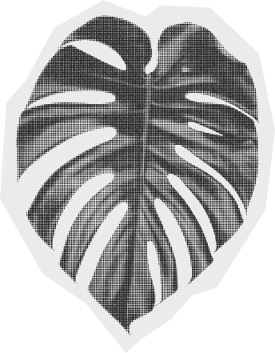
      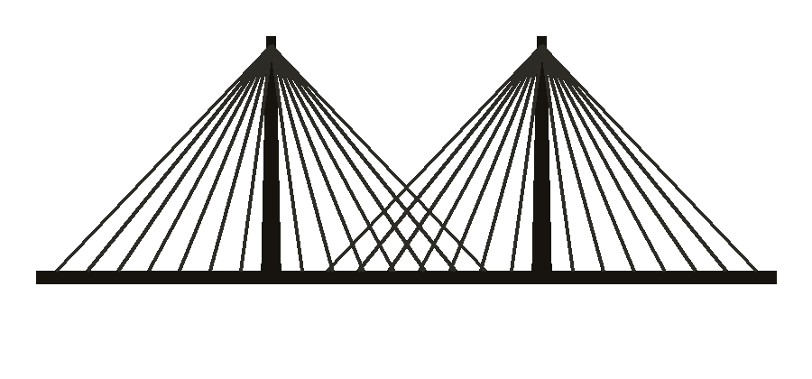
      
      <div class="collage-inner">
        <div class="title-orbit">
          <svg class="eye-orbit" viewBox="0 0 1000 400" aria-hidden="true" focusable="false">
            <line class="laser n1" x1="500" y1="35" x2="500" y2="200"></line>
            <line class="laser n2" x1="796" y1="74" x2="500" y2="200"></line>
            <line class="laser n3" x1="953" y1="171" x2="500" y2="200"></line>
            <line class="laser n4" x1="898" y1="282" x2="500" y2="200"></line>
            <line class="laser n5" x1="657" y1="355" x2="500" y2="200"></line>
            <line class="laser n6" x1="343" y1="355" x2="500" y2="200"></line>
            <line class="laser n7" x1="102" y1="283" x2="500" y2="200"></line>
            <line class="laser n8" x1="47" y1="171" x2="500" y2="200"></line>
            <line class="laser n9" x1="204" y1="74" x2="500" y2="200"></line>
            <image class="orbit-eye-img n1" href="assets/img/icon-eye.png?v=2" x="474" y="19" width="52" height="32"></image>
            <image class="orbit-eye-img n2" href="assets/img/icon-eye.png?v=2" x="770" y="58" width="52" height="32"></image>
            <image class="orbit-eye-img n3" href="assets/img/icon-eye.png?v=2" x="927" y="155" width="52" height="32"></image>
            <image class="orbit-eye-img n4" href="assets/img/icon-eye.png?v=2" x="872" y="266" width="52" height="32"></image>
            <image class="orbit-eye-img n5" href="assets/img/icon-eye.png?v=2" x="631" y="339" width="52" height="32"></image>
            <image class="orbit-eye-img n6" href="assets/img/icon-eye.png?v=2" x="317" y="339" width="52" height="32"></image>
            <image class="orbit-eye-img n7" href="assets/img/icon-eye.png?v=2" x="76" y="267" width="52" height="32"></image>
            <image class="orbit-eye-img n8" href="assets/img/icon-eye.png?v=2" x="21" y="155" width="52" height="32"></image>
            <image class="orbit-eye-img n9" href="assets/img/icon-eye.png?v=2" x="178" y="58" width="52" height="32"></image>
          </svg>
          <h2 class="collage-title"><span class="line line-portafolio">Portafolio</span><span class="line line-creativo">Creativo</span></h2>
        </div>
        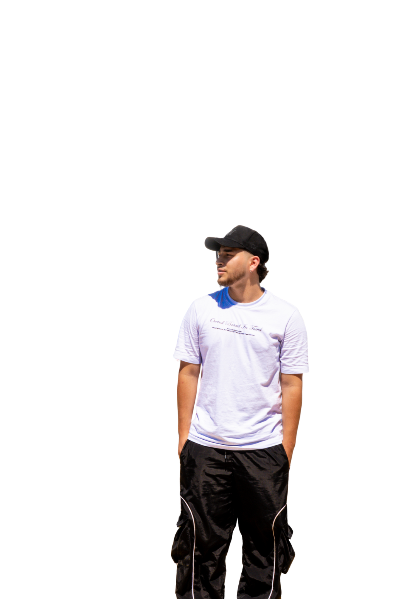
      </div>
      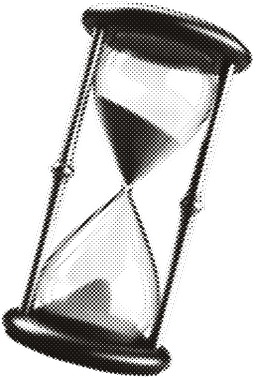
      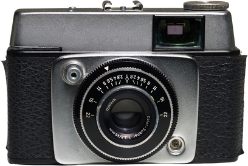
    </div>
  </section>

  <!-- INTRO -->
  <section class="on-cream pad">
    <div class="container split reveal">
      <div>
        <p class="kicker">Hola, soy Brant</p>
        <h2 class="h-display section-title" style="font-size:clamp(2.4rem,5vw,3.6rem)">Director creativo<br>&amp; filmmaker</h2>
        <p class="lede">Exploro el cine, el diseño y el storytelling para transformar ideas en experiencias visuales...</p>
        <div style="margin-top:32px; display:flex; gap:16px; flex-wrap:wrap;">
          <a href="proyectos.html" class="btn btn-solid">Ver proyectos</a>
          <a href="sobre-mi.html" class="btn btn-outline">Sobre mí</a>
        </div>
      </div>
      <div class="split-media">
        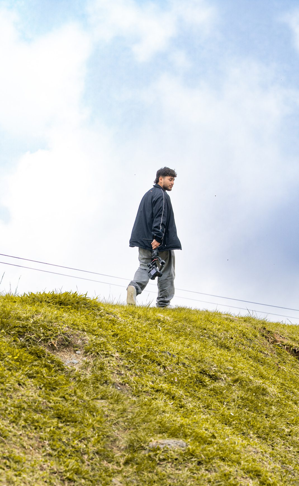
      </div>
    </div>
  </section>

  <!-- STATS -->
  <section class="on-dark pad">
    <div class="container reveal">
      <p class="kicker">Alcance</p>
      <p class="stat-figure"><span class="accent">782,7</span> mil</p>
      <p class="eyebrow-row" style="margin-top:6px">Visualizaciones en Instagram · Últimos 30 días</p>

      <div class="stat-cols" data-stagger>
        <div><h3>131,2 mil</h3><p>Interacciones en el último mes.</p></div>
        <div><h3>+207</h3><p>Nuevos seguidores en el último mes.</p></div>
        <div><h3>27</h3><p>Publicaciones compartidas.</p></div>
      </div>

      <hr class="divider" style="margin-top:56px">
      <p class="eyebrow-row" style="margin-top:32px">Producciones seleccionadas</p>
      <div class="tag-row">
        <span>FICGS</span><span>Callejeando</span><span>Nacidos del Río</span><span>Los Patarroyos</span><span>Chirrete</span>
      </div>
    </div>
  </section>

</main>

<div data-include="footer"></div>

<script src="js/preloader.js?v=3"></script>
<script src="js/include.js?v=3"></script>
<script src="js/main.js?v=2"></script>
</body>
</html>
```

---

## fotografia.html (página completa — grids con lightbox + tarjetas de sesión)

```html
<!DOCTYPE html>
<html lang="es">
<head>
<meta charset="UTF-8">
<meta name="viewport" content="width=device-width, initial-scale=1.0">
<title>Fotografía — Brant · Bacu Creative</title>
<link rel="preconnect" href="https://fonts.googleapis.com">
<link rel="preconnect" href="https://fonts.gstatic.com" crossorigin>
<link href="https://fonts.googleapis.com/css2?family=Anton&family=Playfair+Display:ital,wght@0,400..700;1,400..700&family=Inter:ital,wght@0,400;0,500;0,600;0,700;1,800&display=swap" rel="stylesheet">
<link rel="stylesheet" href="css/style.css?v=21">
</head>
<body>

<a href="#main" class="skip-link">Saltar al contenido</a>

<div id="preloader" aria-hidden="true">
  
  <div class="pre-lines">
    <p class="pre-line-1">Estamos construyendo algo bien chimba.</p>
    <p class="pre-line-2">Gracias por esperar. Estamos preparando una experiencia hecha con detalle.</p>
  </div>
  <div class="pre-bar-track"><div class="pre-bar-fill"></div></div>
</div>

<div data-include="nav"></div>

<main id="main">

  <!-- DIVISIONES -->
  <section class="on-cream pad" style="padding-bottom:0">
    <div class="container reveal">
      <p class="kicker">Fotografía</p>
      <h1 class="h-serif section-title">Divisiones</h1>

      <div class="bts-grid" data-stagger data-lightbox>
        <figure class="big">
          
          <figcaption>Retrato</figcaption>
        </figure>
        <figure>
          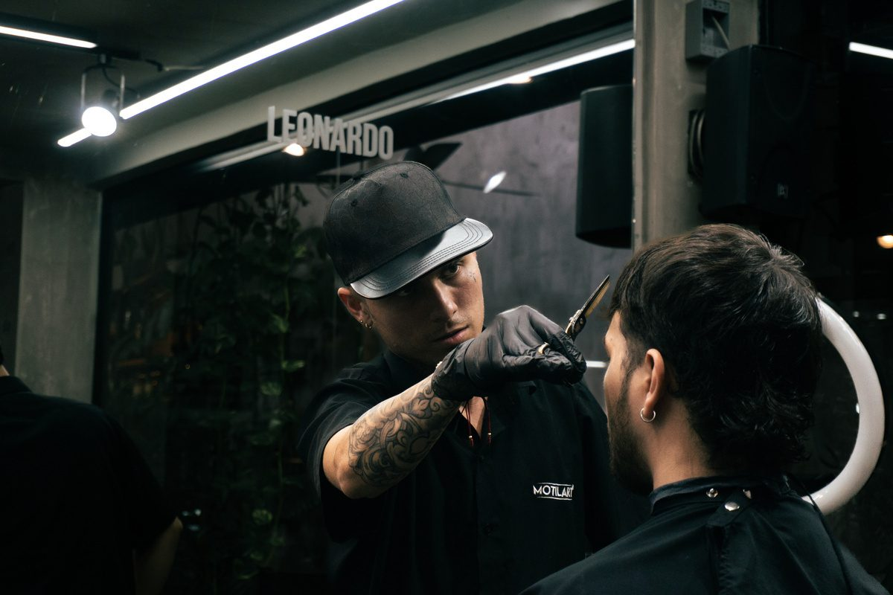
          <figcaption>Editorial</figcaption>
        </figure>
        <figure>
          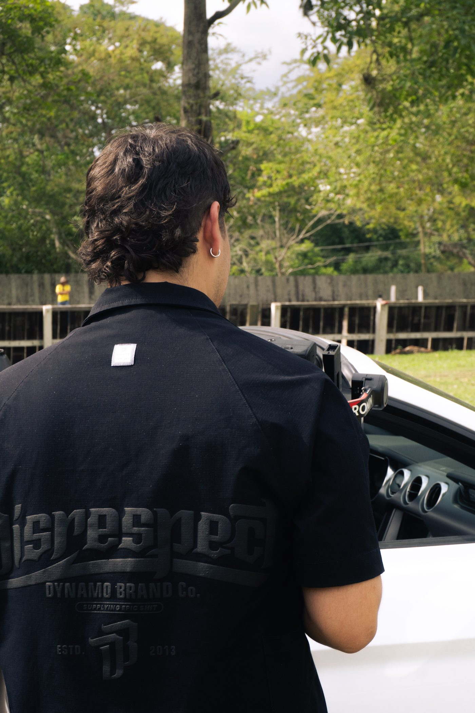
          <figcaption>Documental</figcaption>
        </figure>
      </div>
    </div>
  </section>

  <!-- SESIONES REALES (renderizadas desde data/sessions.js) -->
  <section class="on-cream-2 pad">
    <div class="container reveal">
      <p class="kicker">Trabajo reciente</p>
      <h2 class="h-serif section-title">Sesiones</h2>
      <p class="lede" style="margin-top:14px; max-width:56ch">Entra a cada sesión para ver la galería completa y detallar cada foto.</p>

      <div class="session-grid" id="session-grid" aria-live="polite"></div>
    </div>
  </section>

  <!-- BTS -->
  <section class="on-dark pad">
    <div class="container reveal">
      <p class="kicker">Entre bastidores</p>
      <h2 class="h-serif section-title" style="color:var(--cream)">El set desde adentro</h2>

      <div class="bts-grid" data-stagger data-lightbox>
        <figure class="big">
          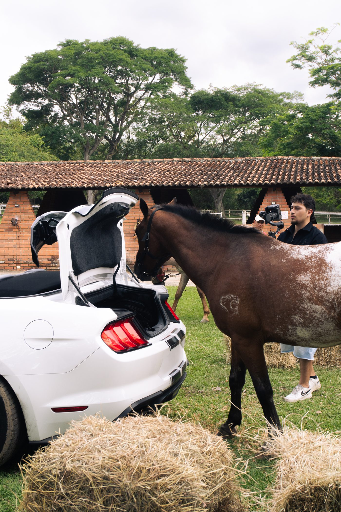
          <figcaption>Rodaje</figcaption>
        </figure>
        <figure>
          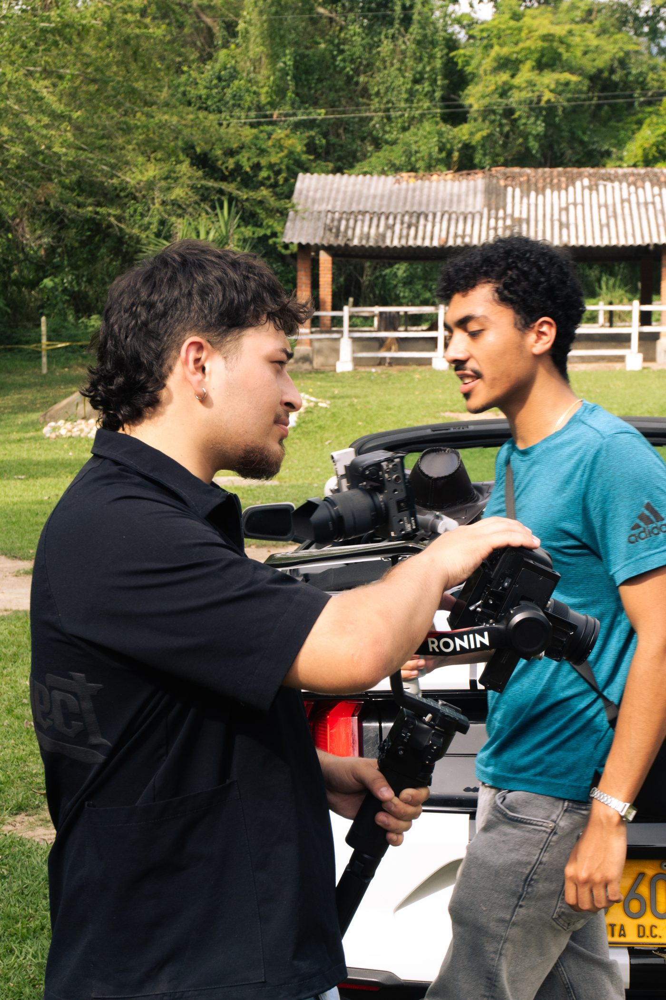
          <figcaption>Equipo</figcaption>
        </figure>
        <figure>
          
          <figcaption>Luces</figcaption>
        </figure>
        <figure>
          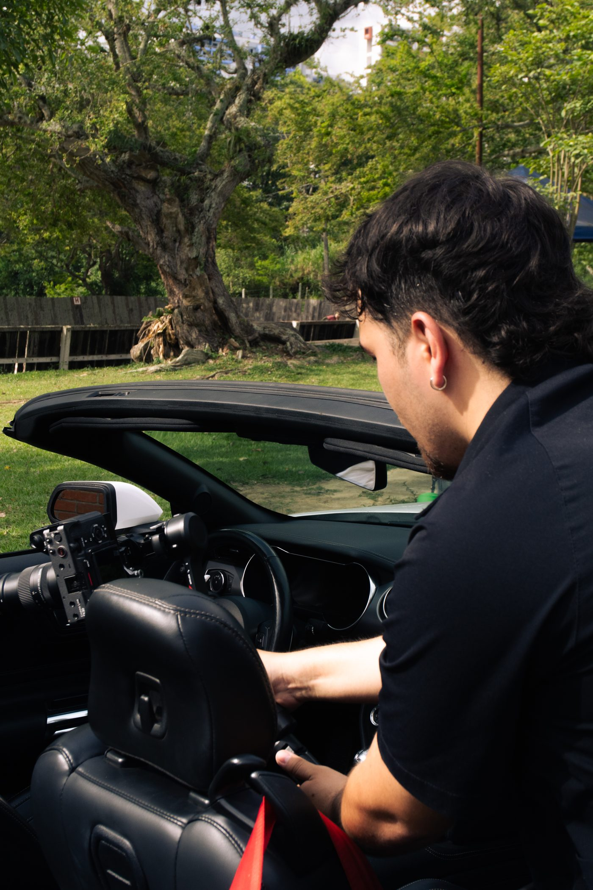
          <figcaption>Cámara</figcaption>
        </figure>
        <figure class="big">
          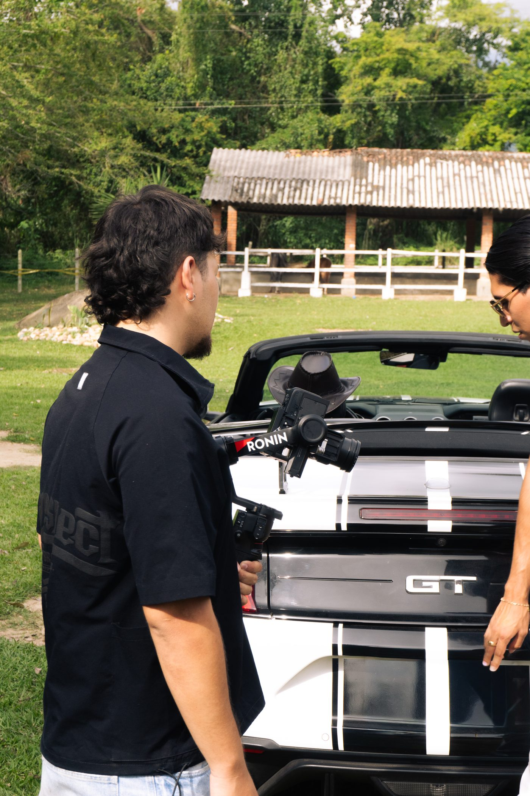
          <figcaption>Producción</figcaption>
        </figure>
        <figure>
          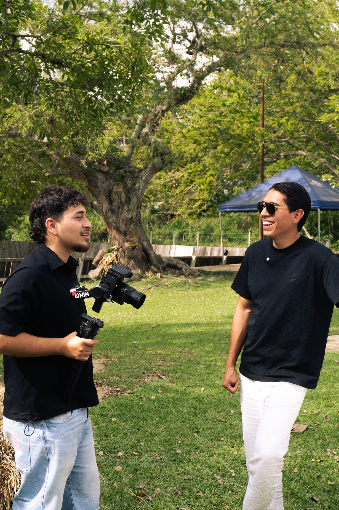
          <figcaption>Detrás de escena</figcaption>
        </figure>
      </div>
    </div>
  </section>

</main>

<div data-include="footer"></div>

<div id="lightbox" class="lightbox" aria-hidden="true" role="dialog" aria-modal="true" aria-label="Foto ampliada">
  <button class="lightbox-close" aria-label="Cerrar">&times;</button>
  <button class="lightbox-prev" aria-label="Foto anterior">&#8249;</button>
  
  <button class="lightbox-next" aria-label="Foto siguiente">&#8250;</button>
  <p class="lightbox-caption"></p>
</div>

<script src="js/preloader.js?v=3"></script>
<script src="js/include.js?v=3"></script>
<script src="data/sessions.js?v=1"></script>
<script src="js/render-sessions.js?v=1"></script>
<script src="js/lightbox.js?v=1"></script>
<script src="js/main.js?v=2"></script>
</body>
</html>
```

---

## sesion.html (página completa — plantilla reusable para UNA sesión)

```html
<!DOCTYPE html>
<html lang="es">
<head>
<meta charset="UTF-8">
<meta name="viewport" content="width=device-width, initial-scale=1.0">
<title>Sesión — Brant · Bacu Creative</title>
<link rel="preconnect" href="https://fonts.googleapis.com">
<link rel="preconnect" href="https://fonts.gstatic.com" crossorigin>
<link href="https://fonts.googleapis.com/css2?family=Anton&family=Playfair+Display:ital,wght@0,400..700;1,400..700&family=Inter:ital,wght@0,400;0,500;0,600;0,700;1,800&display=swap" rel="stylesheet">
<link rel="stylesheet" href="css/style.css?v=21">
</head>
<body>

<a href="#main" class="skip-link">Saltar al contenido</a>

<div id="preloader" aria-hidden="true">
  
  <div class="pre-lines">
    <p class="pre-line-1">Estamos construyendo algo bien chimba.</p>
    <p class="pre-line-2">Gracias por esperar. Estamos preparando una experiencia hecha con detalle.</p>
  </div>
  <div class="pre-bar-track"><div class="pre-bar-fill"></div></div>
</div>

<div data-include="nav"></div>

<main id="main">

  <!-- SESIÓN (renderizada desde data/sessions.js según ?id=) -->
  <section class="on-cream pad">
    <div class="container reveal">
      <a class="session-back" href="fotografia.html">&larr; Volver a fotografía</a>
      <p class="kicker" id="session-kicker">Sesión</p>
      <h1 class="h-serif section-title" id="session-title">—</h1>
      <p class="lede" style="margin-top:14px" id="session-count"></p>

      <div class="bts-grid" data-stagger data-lightbox id="session-gallery" aria-live="polite"></div>
    </div>
  </section>

</main>

<div data-include="footer"></div>

<div id="lightbox" class="lightbox" aria-hidden="true" role="dialog" aria-modal="true" aria-label="Foto ampliada">
  <button class="lightbox-close" aria-label="Cerrar">&times;</button>
  <button class="lightbox-prev" aria-label="Foto anterior">&#8249;</button>
  
  <button class="lightbox-next" aria-label="Foto siguiente">&#8250;</button>
  <p class="lightbox-caption"></p>
</div>

<script src="js/preloader.js?v=3"></script>
<script src="js/include.js?v=3"></script>
<script src="data/sessions.js?v=1"></script>
<script src="js/render-sessions.js?v=1"></script>
<script src="js/lightbox.js?v=1"></script>
<script src="js/main.js?v=2"></script>
</body>
</html>
```
